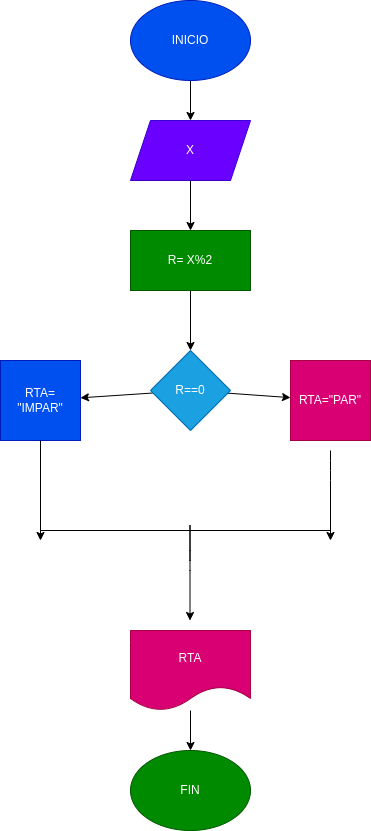

# Ejercicio N.4 

## verificar si un numero es par o impar

# ANALISIS

variable de entrada (imput)

X: numero a verificar

variable del proceso y salida (proccessing,strorang,output)

rta: resultado de la verificacion numero par o impar

# DISEÑO

# CONSTRUCCION